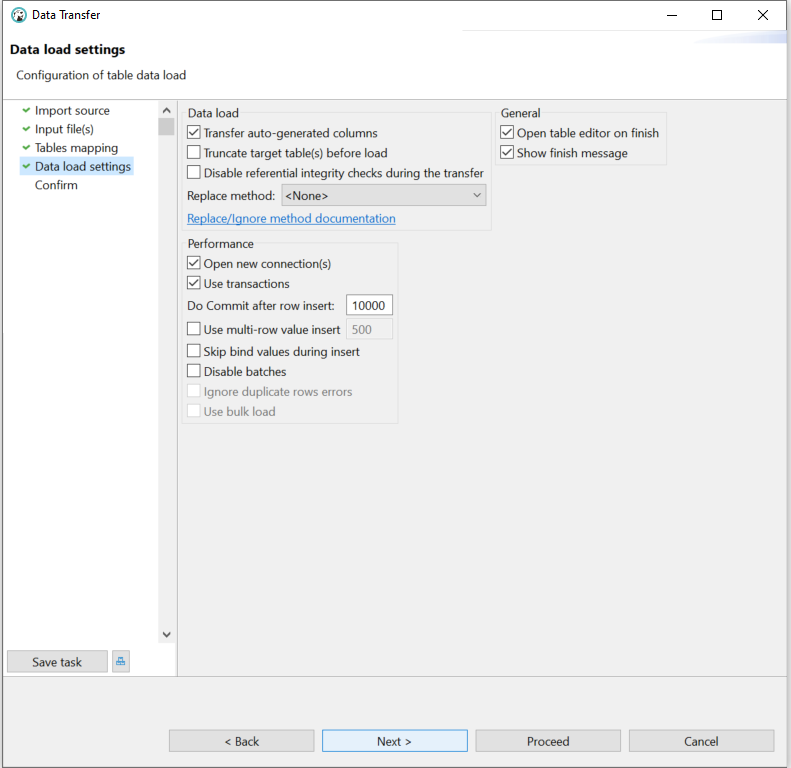

# Import Data

In this activity, you will create a new table and import data into the table from a CSV file. You will then create some queries for the data.

## Overview

The following starter folder contains the CSV file to import data into your database:

* [customer.csv](./starter/customer.csv)

## Instructions

1. Open DBeaver and connect to MySQL.

2. Execute the following SQL statements to create the `customer_db` database:

    ```sql
    CREATE SCHEMA IF NOT EXISTS customer_db;
    USE customer_db;

    -- Drop table if exists
    DROP TABLE IF EXISTS customer;

    -- Create table and view column datatypes
    CREATE TABLE customer (
    customer_id SERIAL PRIMARY KEY,
    first_name VARCHAR(30) NOT NULL,
    last_name VARCHAR(30),
    gender VARCHAR(30),
    age INT,
    address VARCHAR(50),
    city VARCHAR(50),
    state CHAR(2),
    zip_code CHAR(5)
    );
    ```

3. Double-click on the `customer_db` database, and expand the Tables menu. Then right-click on the `customer` table, and select Import Data, as shown in the following image:

    

4. In the Data Transfer dialog, select "Import from CSV file(s)". Select Next to continue, as shown in the following image:

    

5. Navigate to the `customer.csv` file and select Open to continue, as shown in the following image:

    

6. In the Data Transfer dialog, keep the defaults and select Next to continue, as shown in the following image:

    

7. In the Data Transfer dialog, keep the defaults and select Next to continue, as shown in the following image:

    

8. In the Data Transfer dialog, keep the defaults and select Next to continue, as shown in the following image:

    

9. In the Data Transfer dialog, keep the defaults and select Proceed to continue, as shown in the following image:

    

10. Execute the following SQL to confirm that the data has been imported into the `customer` table:

    ```sql
    USE customer_db;

    -- Query and return all data from customer table
    SELECT *
    FROM customer;
    ```

11. Write queries for and return the following data:

    * All female customers

    * All male customers from New Jersey

    * All male customers from New Jersey or Ohio

12. **Bonus**: Query and return all female customers from Maryland who are younger than 30 years old.

---

© 2023 2U. All Rights Reserved.
