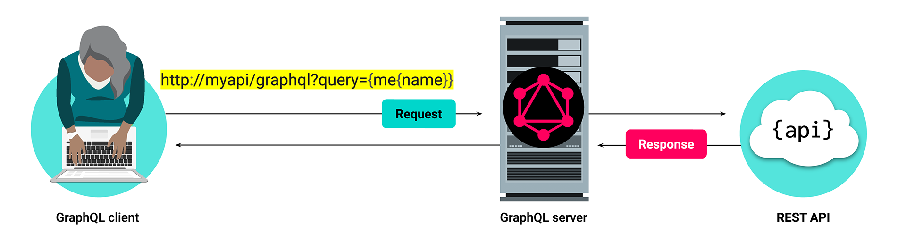
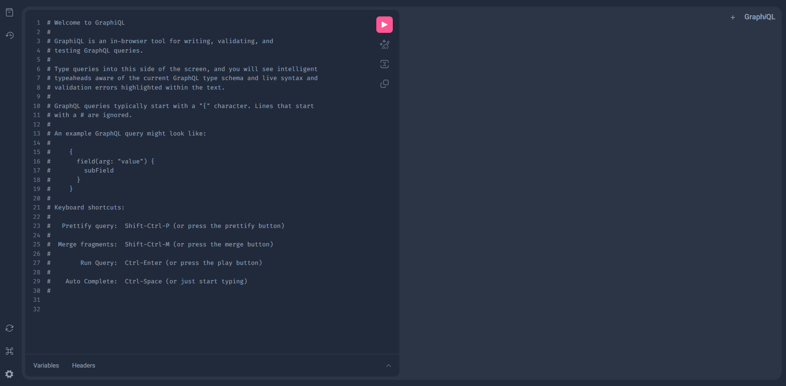
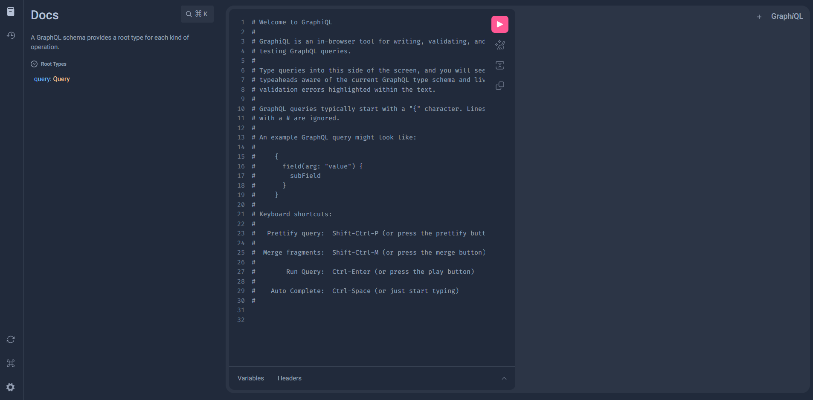
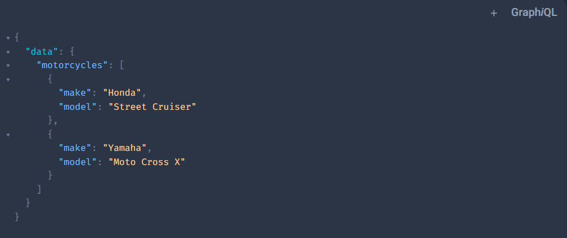
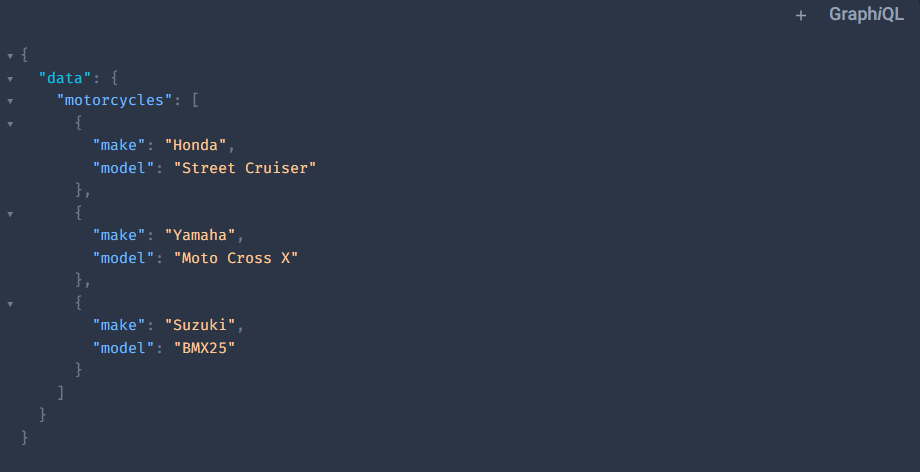

# We Do: Build a Spring Boot Java GraphQL API

For the remainder of this lesson, we'll work through the steps to build a simple, in-memory Spring Boot GraphQL Java API, and we'll use a tool called **GraphiQL** to make data requests to the API in GraphQL format. GraphiQL is similar to DBeaver for SQL. GraphiQL allows us to exercise (basically, play around with) the GraphQL API so that we know that it works. If we access a GraphQL API along a certain port number, it sends the GraphiQL screen back to the browser, as shown in the following image:



In this section, we'll create a MotoInventory API that will manage the inventory for a motorcycle warehouse. This API will serve data via GraphQL requests.

Here are the high-level steps that we'll follow to create the project:

1. Generate the starter project with Spring Initializr.

2. Add the GraphQL dependencies.

3. Set up the `application.properties` configuration file.

4. Create the GraphQL schema file.

5. Create a model class.

6. Create a repository class.

7. Create the Graph Controller.

8. Use GraphiQL to test the API.

Complete these steps yourself, alongside this demonstration, to create your very own Spring Boot Java GraphQL API. You’ll build on this API in the next lesson.

Let’s get started!

## Generate the project

1. Navigate to the [Spring Initializr webpage](http://start.spring.io).

2. Create a new project as follows:

    - Project: `Maven`

    - Language: `Java`

    - Spring Boot: `2.7.7 (SNAPSHOT)`

    - Project Metadata:

      - Group: `com.company`

      - Artifact: `moto-inventory`

        >Setting the Artifact value will automatically update the values for Name and Package Name.

      - Package name: `com.company.motoinventory`

      - Packaging: `Jar`

      - Java: `8`

3. Add the following dependencies:

   - `Spring Web [WEB]`

   - `Spring for GraphQL [WEB]`

4. Click Generate Project, and download to a location of your choice.

5. Unzip the project file.

6. Open the project in IntelliJ.

## Add the GraphQL Dependencies

1. Open the `pom.xml` file.

2. Add dependencies to the `Pom.xml` file as follows:

    - For GraphQL, paste the following dependency XML into the `Pom.xml` project file:

        ```xml
        <dependency>
            <groupId>org.springframework.boot</groupId>
            <artifactId>spring-boot-starter-graphql</artifactId>
        </dependency>
        <dependency>
            <groupId>org.springframework</groupId>
            <artifactId>spring-webflux</artifactId>
            <scope>test</scope>
        </dependency>
        <dependency>
            <groupId>org.springframework.graphql</groupId>
            <artifactId>spring-graphql-test</artifactId>
            <scope>test</scope>
        </dependency>
        ```

      - Import the new dependencies (via a manual or an automatic import).

3. Start the project and confirm that Spring successfully builds and runs.

## Set Up application.properties Configuration File

1. In order to make use of the Graph*i*QL tool, we have to enable it within the `application.properties` file:

    ```java
    spring.graphql.graphiql.enabled=true
    ```

2. Restart the application and confirm it builds and runs.

## Create the GraphQL Schema File

Now our Schemas for GraphQL have to live in a specific directory in the `resources` directory

1. Create a new directory named `graphql` under the `resources` directory.

2. In the `graphql` directory, add a schema file named `schema.graphqls`.

    > **Note**: Under the Spring Boot framework, Spring will search the `classpath` for any schema file that has a `.graphqls` suffix.

3. Note that IntelliJ might alert you that a GraphQL plugin is available. When that happens, it's generally a good idea to download the plugin.

4. In `schema.graphqls`, create the initial GraphQL schema file entries as follows:

    ```java
    type Motorcycle {
        id: String!
        make: String!
        model: String!
        year: Int!
    }

    type Query {
        motorcycles: [Motorcycle]!
       findMotorcycleById(id:String): Motorcycle
    }
    ```

5. Note that we just defined a `Motorcycle` type that consists of the following fields:

    - `id`

    - `make`

    - `model`

    - `year`

6. Note that we also defined one `Query` operation named `motorcycles` that returns a list of `Motorcycle` entries, and we created a second `Query` operation that returns one `Motorcycle` object based on its `id`.

## Create a Model Class

Create a model class named `Motorcycle` in a package named `models`. To do so, complete the following steps:

1. Add the following instance variables:

    ```java
    private String id;
    private String make;
    private String model;
    private int year;
    ```

2. Add the standard constructors, getters and setters, and `equals` and `hashCode` methods.

## Create a Repository Class

1. Create a class named `MotorcycleRepository` in a package named `repository`.

2. In this `repository` class, write code to achieve the following:

    - Add the `@Component` annotation to the class.

    - Add a constructor that calls a method named `seedDataStore`.

    - Create an empty list of `Motorcycle` objects.

    - Create the `seedDataStore` method. Inside that method, create two new `Motorcycle` objects, and then add them to the list that we created in a previous step.

    - Add a method named `getMotorcycles` that returns a list of `Motorcycle` objects from the in-memory data store.

    - Add a method named `getMotorcycleById` that returns one `Motorcycle` object based on its `id` from the in-memory data store.

3. Note that this class will serve as the data repository for this tutorial.

    > **Note**: Normally we use a database, but in this tutorial, we'll use this in-memory list for simplicity&mdash;and to keep the focus on GraphQL use and functionality.

## Create the Query Operation

Recall that a REST API uses a controller class as the access point to the API endpoints. Likewise, the GraphQL API needs a class to serve as a routing class for the GraphQL requests that the API receives.

To create a class that will serve this purpose, complete the following steps:

1. Create a new class named `GraphController`, and place it in the `controller` package.

2. In this `GraphController` class, write code to achieve the following:

    - Annotate the class with the `@Controller` annotation.

    - Autowire the `MotorcycleRepository` class to allow access to the repository.

    - Create one method named `motorcycles` that returns a list of the `Motorcycle` objects that exist in the data store, and create a second method named `findMotorcycleById` that returns one `Motorcycle` object based on its `id` from the data store.

      > **Important**: We specifically name the methods `motorcycles` and `findMotorcycleById` because when we created the schema, we created GraphQL queries named `motorcycles` and `findMotorcycleById`. Recall those query definitions:
      >
      > ```java
      > type Query {
      >     motorcycles: [Motorcycle]!
      >     findMotorcycleById(id:String): Motorcycle
      > }
      > ```

    - For each method we have written, we need to annotate the method with the `@QueryMapping` annotation

      - We also need to annotate any arguments with the `@Argument` annotation

        ```java
        @QueryMapping
        public Motorcycle findMotorcycleById(@Argument String id) {
        ```

        > **Note:** `@Argument` allows us to map to an object and not just a basic type.

3. Remember that when you send a GraphQL request, the request must specify the operation to call and the requested fields. Here is an example of the operation that will be associated with the `motorcycles` method that we just created in the `GraphController` class:

    ```json
    {
        motorcycles {make model}
    }
    ```

## Use GraphiQL to Test the API

Now it's time to test the API that we created!

To test the API, complete the following steps:

1. Restart the API.

2. Open a browser and navigate to `localhost:8080/graphiql`.

3. The GraphiQL UI should open. (Remember, GraphiQL is a tool that we use to exercise the GraphQL API, similar to pgAdmin for SQL.)

4. Check that your screen resembles the following image:

      

5. If we click on the book icon in the upper left-hand corner, we can see the created documentation for our schemas:

    

6. Click the schema link: `query: Query`. Note that it expands to display the details of the schema.

7. Run some GraphQL queries against the API, as follows:

    - In the editor pane, which contains the text `Welcome to GraphiQL`, delete all the contents from the pane. Then write the following query:

        ```json
        {
            motorcycles {make model}
        }
        ```

    - Click the Run button.

    - Note that the result of the query displays all the motorcycles in the data store. And because we requested only the `make` and the `year` fields, only those values display, as shown in the following image:

      

    - Note that we can change the list of requested fields in the query without changing the API, and the Java GraphQL API will return only what we request. Try some!

Congratulations! You just created a functioning Spring Boot Java GraphQL API.

Remember, GraphQL supports other CRUD operations by implementing a combination of GraphQL operations and mutations. So far, the API that you’ve created can support the CRUD **retrieve** operation. Next, you’ll use GraphQL **mutations** to add the remaining CRUD operation functionality (create, update, and delete) to the `graphql-moto-inventory-project` API.

## Create the Add Mutation Operation

Previously, we used the `Query` operation type to create the `getMotorcycles` and `getMotorcycleById` operations (for the retrieve CRUD operations). Now we will need to add `Mutation` operations to create, update, and delete motorcycle data. To do so, complete the following steps:

1. Begin by creating a new `Mutation` type in the schema file, as shown in the following code:

    ```java
    type Mutation {
        addMotorcycle(id:String make:String model:String year:Int): Motorcycle
    }
    ```

2. Create an `addMotorcycle` method in the `MotorcycleRepository` to handle the addition of a `Motorcycle` to the in-memory data store.

3. Create a controller for our new method using the `@MutationMapping` annotation in our `GraphController` class.

    - **Remember** to use `@Argument` before each parameter!

4. Test the new query in GraphiQL using the following:

   ```json
   mutation {
        addMotorcycle(id: "33333", make: "Suzuki", model: "BMX25", year: 1988) {
            id
            make
            model
            year
        }
    }
   ```

5. GraphiQL should show the new data that was added. If you want to see the new motorcycle in our memory, use the previous query to return all motorcycles.

    

## Create the Update and Delete Mutation Operations

Apply the same basic steps that we used to add a CRUD create operation to implement CRUD **update** and **delete** operations in your API.

## GraphQL CRUD Operation Test Queries

Write and execute the following GraphQL test queries to see all of our methods in action:

1. Retrieve:

    ```json
    {
      motorcycles {id make model year}
    }
    ```

     - `findMotorcycleById`:  

        ```json
        {
          findMotorcycleById(id: "11111") {
              id
              make
              model
              year
          }
        }
        ```

2. Create:

    ```json
    mutation {
        addMotorcycle(id: "33333", make: "Suzuki", model: "BMX25", year: 1988) {
            id
            make
            model
            year
        }
    }
    ```

3. Update:

    ```json
    mutation {
        updateMotorcycle(
            id: "33333"
            make: "UpdatedSuzuki"
            model: "UpdatedBMX25"
            year: 2021
        ) {
            id
            make
            model
            year
        }
    }
    ```

4. Delete:

    ```json
    mutation {
        deleteMotorcycleById(id: "33333")
    }
    ```

---

© 2023 2U. All Rights Reserved.
